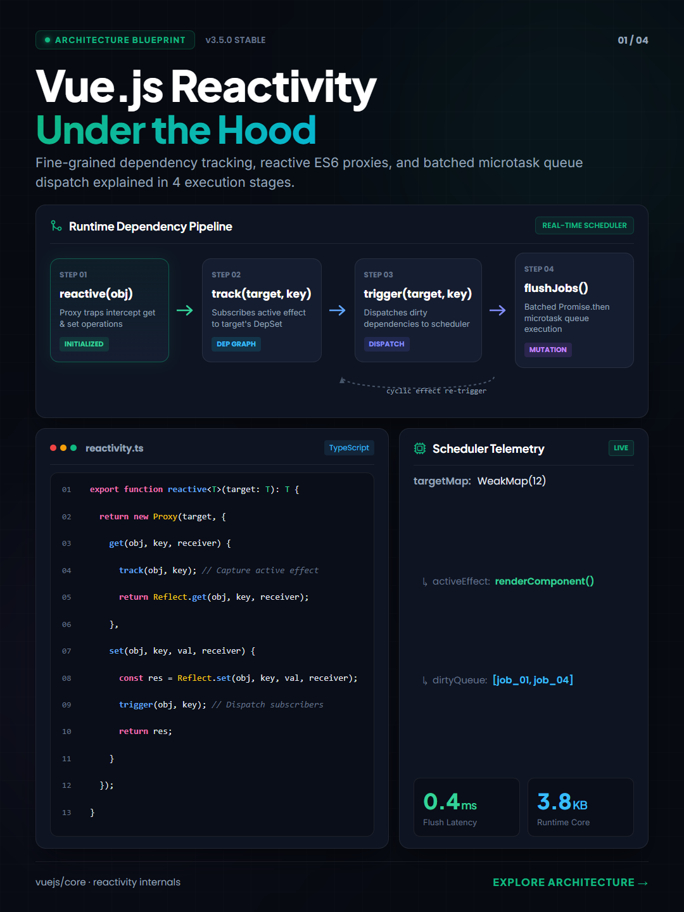
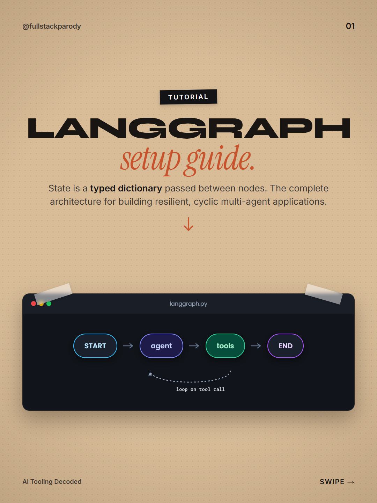
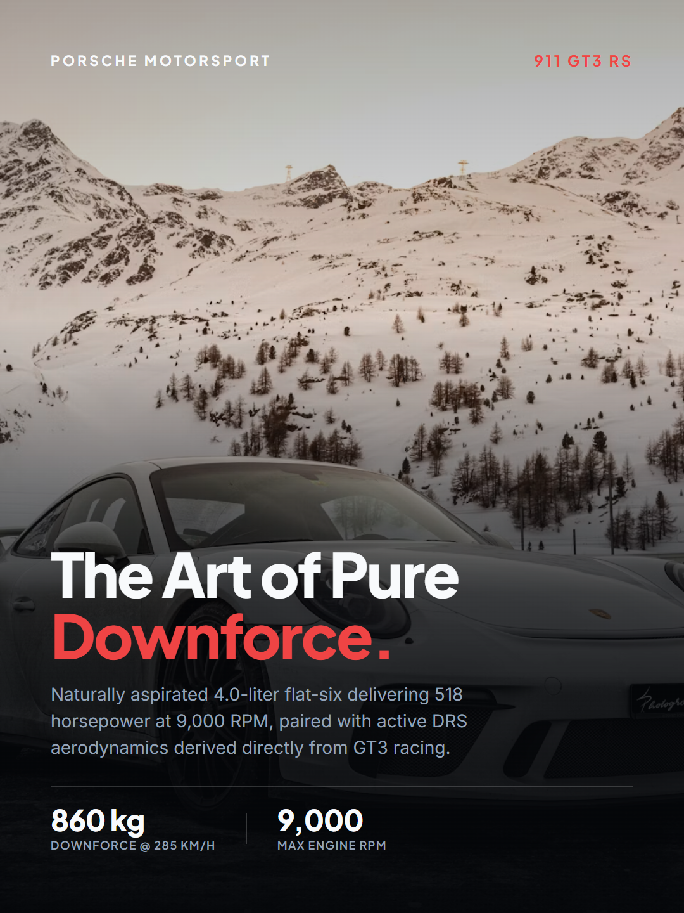
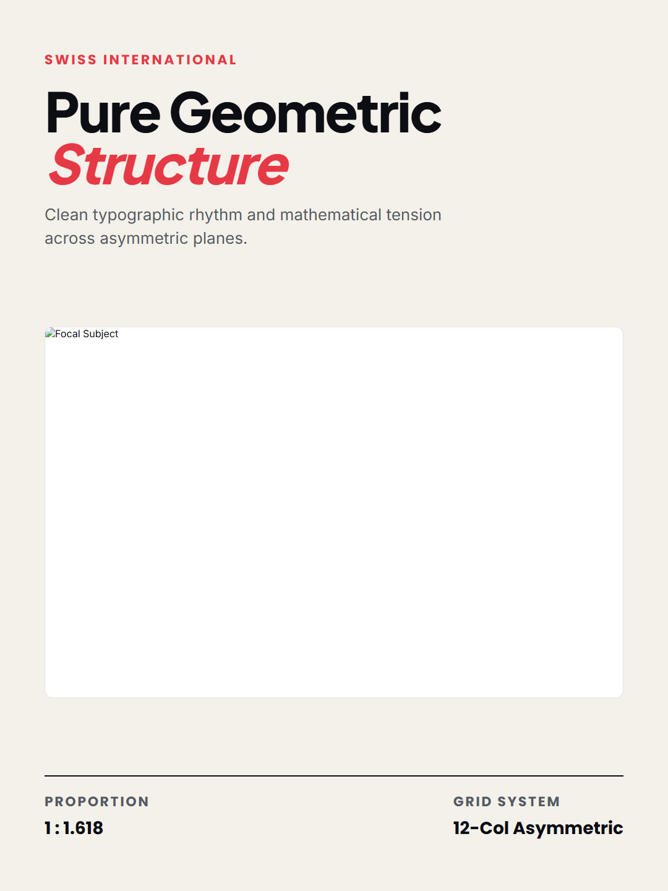
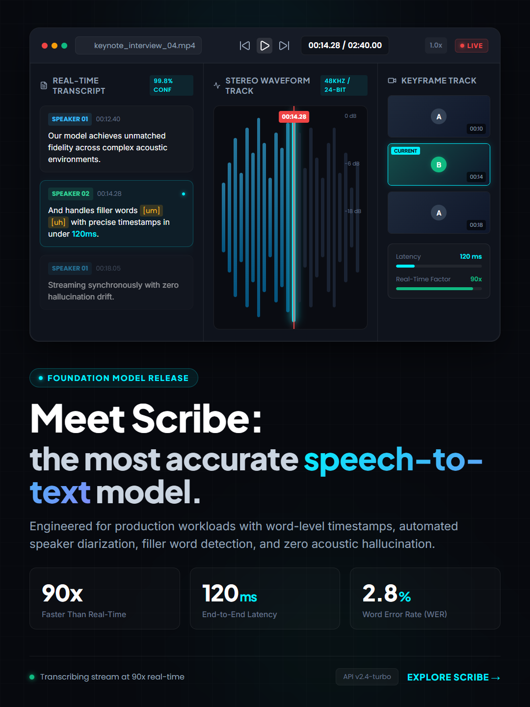

# Prismo 🎨

> **High-Density Multi-Ratio Social Poster & Visual Design Engine (3:4 · 9:16 · 16:9 · 1:1 · 4:3)**

Prismo is a standalone, AI-powered design engine engineered to generate production-ready social infographic posters across 5 canonical geometries (**3:4**, **9:16**, **16:9**, **1:1**, and **4:3**) with integer-safe pixel math, rich Bento grids, bespoke geometric SVGs, Lucide vector icons, directional dark scrims, and dynamic color theme presets. Built with a clean framework-neutral headless engine boundary (`core/index.ts`), it can run as an interactive Studio, via standalone CLI, or embedded directly as a headless design capability inside chat interfaces, agents, and batch workflows.

---

## 🖼️ Shipped Design Templates & Archetypes

Prismo ships with battle-tested poster templates across diverse visual archetypes, engineered with strict Hallmark visual discipline, custom typography, and directional dark scrims:

| Template | Preview | Archetype & Highlights |
| :--- | :---: | :--- |
| **Bento Execution Pipeline**<br>*(3:4 · 1080&times;1440)* | <a href="assets/templates/bento-execution-pipeline.png"></a> | **Architecture & Telemetry**<br>• Multi-step execution pipeline with active status nodes<br>• Glowing SVG path connectors & telemetry inspector<br>• Monospace-free syntax card with Poppins & Plus Jakarta Sans |
| **Kraft Paper Architecture**<br>*(3:4 · 1080&times;1440)* | <a href="assets/templates/kraft-architecture.png"></a> | **Tactile Editorial**<br>• Textured kraft background with black tape badges<br>• High-contrast brutalist sans + italic serif display hierarchy<br>• Taped terminal card with stateful orchestration pipeline |
| **Cinematic Motorsport & Supercars**<br>*(3:4 · 1080&times;1440)* | <a href="assets/templates/motorsport-supercars.png"></a> | **Cinematic Hero Editorial**<br>• Full-bleed imagery with directional dark scrim<br>• High-impact display typography with vermilion accent<br>• Minimal aerodynamic spec strip with zero card clutter |
| **Swiss International Typographic**<br>*(3:4 · 1080&times;1440)* | <a href="assets/templates/swiss-international.png"></a> | **Swiss Minimalist**<br>• Rigorous mathematical grid & asymmetric whitespace tension<br>• Unadorned neo-grotesque display typography<br>• Focal photography window with micro-metadata coordinates |
| **Inverted UI Telemetry**<br>*(3:4 · 1080&times;1440)* | <a href="assets/templates/ui-telemetry-inverted.png"></a> | **UI-First Darkroom**<br>• Top-heavy inverted UI with audio waveform & scrubber<br>• Timestamped speaker diarization transcript card<br>• Real-time model inference status & latency chip |

---

## ✨ Features

- **Canonical Multi-Ratio Geometries**: Full support for 5 canonical aspect ratios (**3:4**, **9:16**, **16:9**, **1:1**, **4:3**) with integer-safe pixel dimensions, directional dark scrims, and geometry-adaptive typography.
- **Headless Host Boundary**: Clean, framework-neutral API entrypoint (`core/index.ts`) for embedding directly into host applications (like chat interfaces or batch runners) without UI or network dependencies.
- **Dynamic Thematic Presets**: Automatically detects color palettes from prompt context (e.g. *Amber + Charcoal*, *Cyan + Midnight Titanium*, *Emerald + Gold Luxury*, *Terracotta + Cream*, *Yellow Void*).
- **Anti-AI-Slop Visual Discipline**: Strictly avoids generic purple gradients and raw emojis; leverages structured typography, selective accent styling, and Lucide vector icons.
- **Non-Blocking Asynchronous Export**: Fast, Promise-wrapped headless Chrome export to high-res PNG and JPEG with binary dimension validation and `AbortSignal` cancellation.
- **ModelProvider Seam & Multi-Account Pool**: Decoupled model interface with built-in Gemini account rotation, exponential backoff, and circuit breaker failover.
- **Interactive Studio Panel**: Live preview panel with real-time SSE reloading, multi-ratio preview scaler, and surgical section refinement.

---

## 🚀 Getting Started

### Prerequisites

- Node.js (v20+ with `--experimental-strip-types` support or Node.js v22+)
- Google Chrome or Chromium installed (for headless image export)

### Installation

```bash
# Clone the repository
git clone https://github.com/priyaj-gawade/Prismo.git
cd Prismo

# Install dependencies
npm install
```

### Environment Configuration

Copy `.env.example` to `.env` and provide your Gemini API key:

```bash
cp .env.example .env
```

```env
# Gemini API Key (Required)
GEMINI_KEY_1=your_gemini_api_key_here

# Server Port (Default: 5180)
D8_PORT=5180
```

### Running the Studio

```bash
# Start the Prismo Design Studio Server
npm run serve
```

Visit **`http://localhost:5180`** to access the interactive web studio.

---

## 📂 Architecture

```
Prismo/
├── app/
│   ├── cli/            # Standalone CLI interface
│   └── server/         # HTTP server & static Studio UI panel
├── assets/
│   └── templates/      # High-resolution template generation previews
├── core/
│   ├── index.ts        # Public framework-neutral headless engine boundary
│   ├── config/         # Environment discovery & credential security
│   ├── contracts/      # Engine interfaces & TypeScript schemas
│   ├── design-system/  # Token generator, typography director & presets
│   ├── export/         # Asynchronous headless browser exporter
│   ├── generation/     # Poster generation engine with anti-slop checks
│   ├── geometry/       # Canonical ratio capability & AgentToolRegistry
│   ├── memory/         # Session & persistent markdown memory store
│   ├── prompt/         # Structured prompt composer & Hallmark disciplines
│   ├── providers/      # Gemini multi-account pool & ModelProvider seam
│   ├── templates/      # Grounded poster templates & template registry
│   ├── validation/     # Ratio validation, binary header & anti-slop checks
│   └── workspace/      # Project filesystem manager & diff versioning
├── skills/
│   └── poster/         # Multi-ratio social poster skill specification
├── templates/          # Shipped poster template definitions
├── package.json
└── tsconfig.json
```

---

## 📄 License

Copyright &copy; 2026 Priyaj Gawade. All rights reserved.
